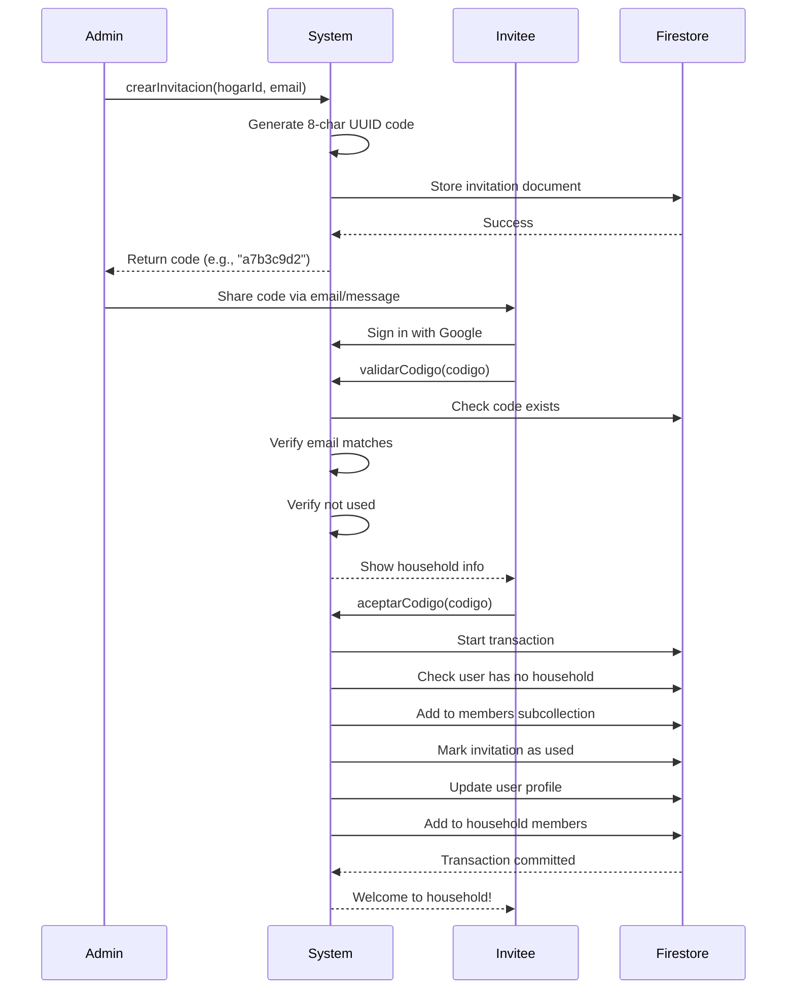

## Overview

The Invitations system (`InvitacionesService` at `src/app/core/invitaciones/services/invitaciones.service.ts`) allows household administrators to invite new members via unique, email-locked invitation codes.

## Invitation Model

Invitations are represented by the `Invitacion` interface:

```typescript
export interface Invitacion {
  id?: string;
  hogarId: string;      // Household ID
  email: string;        // Email address of invitee
  codigo: string;       // Unique invitation code
  creadoEn: any;        // Creation timestamp
  usado: boolean;       // Whether code has been used
  usadoPorUid?: string; // UID of user who accepted
  usadoEn?: any;        // Acceptance timestamp
}
```

## Creating an Invitation

Administrators can create invitations for specific email addresses:

```typescript
async crearInvitacion(hogarId: string, email: string): Promise<string> {
  const codigo = uuidv4().slice(0, 8);
  
  await setDoc(doc(this.fs, 'invitaciones', codigo), {
    hogarId,
    email: email.toLowerCase(),
    codigo,
    creadoEn: serverTimestamp(),
    usado: false,
    usadoPorUid: null,
    usadoEn: null,
  });
  
  return codigo;
}
```

<Steps>
  <Step title="Generate Unique Code">
    The system generates an 8-character code using UUID v4:
    
    ```typescript
    const codigo = uuidv4().slice(0, 8);
    ```
    
    Example codes: `a7b3c9d2`, `f1e8d4c6`
  </Step>
  
  <Step title="Store Invitation">
    The invitation is stored in Firestore with the code as the document ID, ensuring uniqueness:
    
    ```typescript
    await setDoc(doc(this.fs, 'invitaciones', codigo), {
      hogarId,
      email: email.toLowerCase(),
      codigo,
      creadoEn: serverTimestamp(),
      usado: false,
      usadoPorUid: null,
      usadoEn: null,
    });
    ```
  </Step>
  
  <Step title="Return Code">
    The code is returned to the administrator to share with the invitee via email or other means.
  </Step>
</Steps>

<Note>
  Email addresses are normalized to lowercase to ensure case-insensitive matching.
</Note>

## Validating an Invitation Code

Before accepting an invitation, users can validate the code:

```typescript
async validarCodigo(codigo: string): Promise<Invitacion | null> {
  codigo = codigo.trim().toLowerCase();
  const user = this.auth.currentUser;
  if (!user?.email) throw new Error('Tu cuenta no tiene email');
  
  const invRef = doc(this.fs, 'invitaciones', codigo);
  const snap = await getDoc(invRef);
  if (!snap.exists()) return null;
  
  const inv = snap.data() as Invitacion;
  
  if (inv.usado) return null;
  if ((inv.email ?? '').toLowerCase() !== user.email.toLowerCase())
    return null;
  
  return { id: snap.id, ...inv };
}
```

### Validation Rules

<Accordion title="Code Must Exist">
  The code must correspond to a document in the `invitaciones` collection:
  
  ```typescript
  if (!snap.exists()) return null;
  ```
</Accordion>

<Accordion title="Code Must Be Unused">
  Invitation codes can only be used once:
  
  ```typescript
  if (inv.usado) return null;
  ```
</Accordion>

<Accordion title="Email Must Match">
  The current user's email must exactly match the invitation email (case-insensitive):
  
  ```typescript
  if ((inv.email ?? '').toLowerCase() !== user.email.toLowerCase())
    return null;
  ```
  
  This prevents users from using codes meant for others.
</Accordion>

<Warning>
  Users must be signed in with Google to validate invitation codes, as the email verification requires an authenticated user.
</Warning>

## Accepting an Invitation

The `aceptarCodigo()` method executes the complete invitation acceptance workflow:

<Steps>
  <Step title="Validate Prerequisites">
    Ensure the user is authenticated and has an email:
    
    ```typescript
    const user = this.auth.currentUser;
    if (!user) throw new Error('Debes iniciar sesión');
    if (!user.email) throw new Error('Tu cuenta no tiene email');
    ```
  </Step>
  
  <Step title="Validate Invitation Code">
    Revalidate the code to ensure it's still valid:
    
    ```typescript
    const invit = await this.validarCodigo(codigo);
    if (!invit) throw new Error('Código inválido o ya usado');
    ```
  </Step>
  
  <Step title="Execute Transaction">
    Use a Firestore transaction to ensure atomic updates:
    
    ```typescript
    await runTransaction(this.fs, async (trx) => {
      // All updates happen atomically
    });
    ```
  </Step>
  
  <Step title="Check for Existing Household">
    Prevent users from joining if they're already in a household:
    
    ```typescript
    const userSnap = await trx.get(userRef);
    const hogarIdActual = userSnap.exists() 
      ? (userSnap.data() as any)?.hogarId 
      : null;
    
    if (typeof hogarIdActual === 'string' && hogarIdActual.trim().length > 0) {
      throw new Error('Ya perteneces a un hogar');
    }
    ```
  </Step>
  
  <Step title="Add to Members Subcollection">
    Create a member document in the household's subcollection:
    
    ```typescript
    trx.set(memberRef, {
      uid: user.uid,
      codigo,
      email,
      joinedAt: serverTimestamp(),
    });
    ```
  </Step>
  
  <Step title="Mark Invitation as Used">
    Update the invitation to prevent reuse:
    
    ```typescript
    trx.update(invRef, {
      usado: true,
      usadoPorUid: user.uid,
      usadoEn: serverTimestamp(),
    });
    ```
  </Step>
  
  <Step title="Update User Profile">
    Link the user to the household and reset their task counter:
    
    ```typescript
    trx.set(
      userRef,
      {
        hogarId,
        totalTareasRealizadasHogar: 0,
        actualizadoEn: serverTimestamp(),
      },
      { merge: true }
    );
    ```
  </Step>
  
  <Step title="Add to Household Members Array">
    Update the household's main members array:
    
    ```typescript
    await updateDoc(hogarRef, {
      miembros: arrayUnion(user.uid),
      actualizadoEn: serverTimestamp(),
    });
    ```
  </Step>
</Steps>

<Note>
  The transaction ensures that either all operations succeed or all fail, preventing partial joins.
</Note>

## Invitation Workflow Diagram



## Security Features

<CardGroup cols={2}>
  <Card title="Email Verification" icon="envelope-circle-check">
    Codes are locked to specific email addresses, preventing unauthorized use
  </Card>
  
  <Card title="Single Use" icon="check">
    Each code can only be used once, tracked by the `usado` boolean
  </Card>
  
  <Card title="Atomic Operations" icon="atom">
    Transactions ensure all changes succeed or fail together
  </Card>
  
  <Card title="Existing Household Check" icon="shield">
    Prevents users from joining multiple households simultaneously
  </Card>
</CardGroup>

## Code Format

Invitation codes are:
- **8 characters long** (first 8 chars of UUID v4)
- **Case-insensitive** (normalized to lowercase)
- **Unique** (UUID v4 collision probability ≈ 0)
- **Human-shareable** (short enough to type or copy)

<Note>
  Codes are stored as document IDs, making lookups extremely fast (O(1) time complexity).
</Note>

## Error Handling

The service handles various error scenarios:

<Accordion title="No Email on Account">
  ```typescript
  if (!user?.email) throw new Error('Tu cuenta no tiene email');
  ```
  
  All Google accounts should have emails, but this guards against edge cases.
</Accordion>

<Accordion title="Invalid or Used Code">
  ```typescript
  if (!invit) throw new Error('Código inválido o ya usado');
  ```
  
  Users receive a clear error when entering invalid codes.
</Accordion>

<Accordion title="Already in Household">
  ```typescript
  if (typeof hogarIdActual === 'string' && hogarIdActual.trim().length > 0) {
    throw new Error('Ya perteneces a un hogar');
  }
  ```
  
  Users must leave their current household before joining a new one.
</Accordion>

## Best Practices

1. **Email Validation**: Always validate email format before creating invitations
2. **Code Sharing**: Share codes through secure channels (email, encrypted messaging)
3. **Expiration**: Consider implementing code expiration (not currently in the system)
4. **Revocation**: Administrators should be able to delete unused invitations
5. **Audit Trail**: The system tracks who used each code and when

## Data Cleanup

When a household is deleted, all associated invitations are removed:

```typescript
await this.deleteByFieldEq('invitaciones', 'hogarId', hogarId);
```

This prevents orphaned invitation codes from existing after household deletion.
