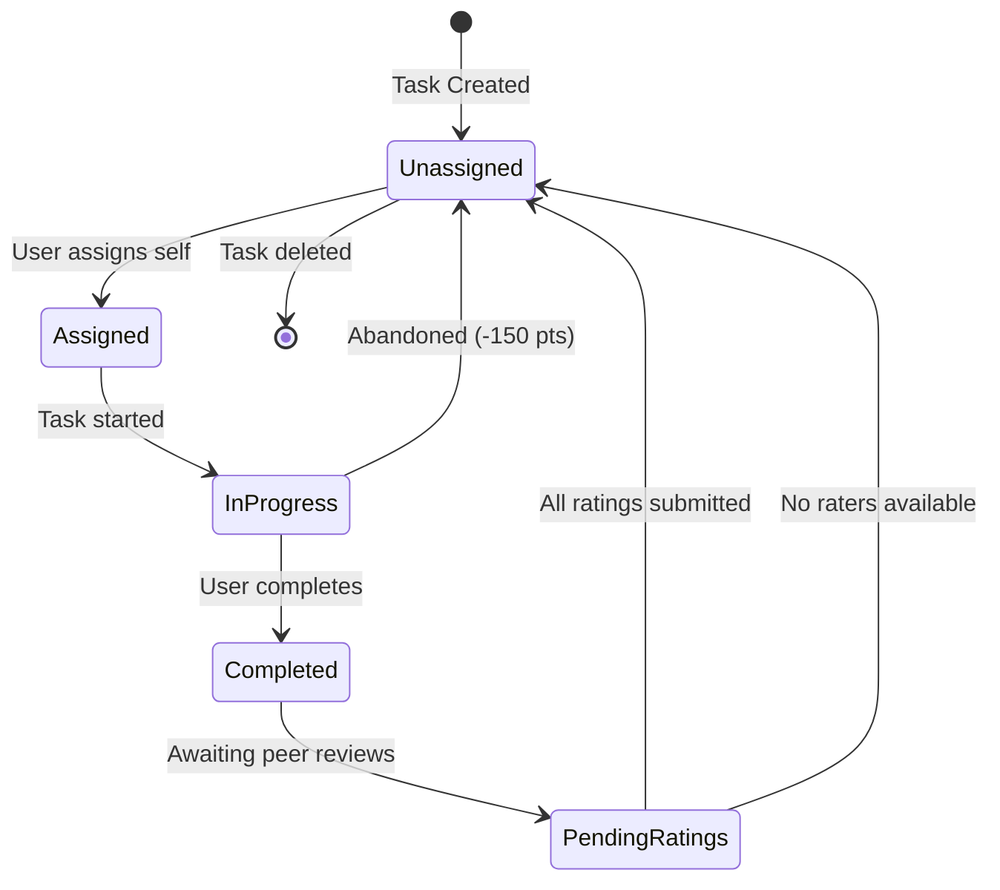

## Overview

The Tasks system (`TareasService` at `src/app/core/tareas/services/tareas.service.ts`) manages collaborative household chores with assignment, completion tracking, and peer-reviewed rating.

## Task Model

Tasks are represented by the `Tarea` interface:

```typescript
export interface Tarea {
  id?: string;
  nombre: string;
  descripcion?: string;
  completada: boolean;
  asignadA?: string | null;         // UID of assigned user
  hogarId: string;
  createdAt?: Timestamp | FieldValue;
  asignadoNombre?: string | null;
  asignadoFotoURL?: string | null;
  peso?: number;                    // Task weight multiplier
  personalizada?: boolean;          // Custom vs default task
  creadorUid: string;
  creadorNombre?: string | null;
  creadorFotoURL?: string | null;
  
  historial?: TaskHistoryEntry[];   // Completion history
  valoraciones?: TaskRating[];      // Peer ratings
  valoracionesPendientes?: string[];// UIDs of pending raters
  bloqueadaHastaValoracion?: boolean;
}
```

## Creating Tasks

### Default Tasks

When a household is created, default tasks are automatically added:

```typescript
crearTareasPorDefecto(hogarId: string, adminUid: string) {
  const batch = writeBatch(this.fs);
  const colRef = collection(this.fs, 'tareas').withConverter(tareaConverter);
  
  TAREAS_POR_DEFECTO.forEach((t) => {
    const ref = doc(colRef);
    batch.set(ref, {
      ...t,
      hogarId,
      creadorUid: adminUid,
      createdAt: serverTimestamp(),
    });
  });
  
  return batch.commit();
}
```

### Custom Tasks

Users can create personalized tasks:

```typescript
async crearTarea(data: {
  nombre: string;
  descripcion?: string;
  hogarId: string;
  personalizada: boolean;
  asignadA?: string | null;
  peso?: number;
  creadorUid: string;
  creadorNombre?: string;
  creadorFotoURL?: string;
}): Promise<string>
```

<Note>
  Custom tasks are marked with `personalizada: true` and can be deleted by household members, while default tasks cannot.
</Note>

## Task Assignment

The `asignarTarea()` method handles task assignment with sophisticated logic:

<Steps>
  <Step title="Validate Assignment Permission">
    Only the currently assigned user can reassign an in-progress task:
    
    ```typescript
    const enCurso = this.esEnCurso(tareaActual);
    const soyAsignado = tareaActual.asignadA === currentUser.uid;
    
    if (enCurso && !soyAsignado) {
      throw new Error('Solo quien la tiene en curso puede reasignar.');
    }
    ```
  </Step>
  
  <Step title="Handle Unassignment (Abandonment)">
    If `nuevoUid` is null, the task is unassigned. If the task was in progress, apply a penalty:
    
    ```typescript
    const penaliza = enCurso && soyAsignado && penalizacionAbandono !== 0;
    
    if (penaliza) {
      nuevaEntrada.puntosOtorgados = PENALIZACION_ABANDONO; // -150
      nuevaEntrada.fechaOtorgados = ahoraIso;
      nuevaEntrada.motivo = 'abandono';
    }
    ```
  </Step>
  
  <Step title="Record in History">
    Save the previous assignment to the task history:
    
    ```typescript
    if (tareaActual.asignadA && tareaActual.asignadoNombre) {
      historialActual.push({
        uid: tareaActual.asignadA,
        nombre: tareaActual.asignadoNombre,
        fotoURL: tareaActual.asignadoFotoURL || '',
        fecha: new Date().toISOString(),
        completada: tareaActual.completada || false,
        hogarId: tareaActual.hogarId,
      });
    }
    ```
  </Step>
  
  <Step title="Assign to New User">
    Fetch the new user's profile and update the task:
    
    ```typescript
    const user = snap.data() as Usuario;
    
    await updateDoc(tareaRef, {
      asignadA: nuevoUid,
      asignadoNombre: user.nombre,
      asignadoFotoURL: user.photoURL || null,
      historial: historialActual,
    });
    ```
  </Step>
</Steps>

<Warning>
  Abandoning a task in progress results in a **-150 point penalty** (defined in `PENALIZACION_ABANDONO`).
</Warning>

## Task Assignment Requests

Users can request others to take their tasks using the petition system:

### Creating a Petition

```typescript
async crearPeticionAsignacion(data: {
  tareaId: string;
  hogarId: string;
  deUid: string;    // Requester UID
  paraUid: string;  // Target UID
}): Promise<void>
```

Petitions are stored in the `peticionesAsignacion` collection with the task ID as the document ID, ensuring only one active petition per task.

### Accepting a Petition

The `aceptarPeticion()` method:

<Steps>
  <Step title="Validate Petition State">
    ```typescript
    if (pet.estado !== 'pendiente') {
      throw new Error('La petición ya fue procesada.');
    }
    ```
  </Step>
  
  <Step title="Check Task Availability">
    Ensure the task isn't blocked by pending ratings:
    
    ```typescript
    if (tarea.bloqueadaHastaValoracion || 
        (tarea.valoracionesPendientes?.length ?? 0) > 0) {
      throw new Error('No se puede reasignar hasta completar las valoraciones.');
    }
    ```
  </Step>
  
  <Step title="Reassign Task">
    Update the task assignment and mark the petition as accepted in a batch:
    
    ```typescript
    batch.update(tareaRef, {
      asignadA: pet.paraUid,
      asignadoNombre: user.nombre,
      asignadoFotoURL: user.photoURL || null,
      historial: historialActual,
    });
    
    batch.update(petRef, {
      estado: 'aceptada',
      aceptadaEn: serverTimestamp(),
      aceptadaPorUid: pet.paraUid,
      aceptadaPorNombre: user.nombre ?? null,
      aceptacionNotificadaSolicitante: false,
    });
    ```
  </Step>
</Steps>

### Rejecting a Petition

```typescript
async rechazarPeticion(peticionId: string): Promise<void> {
  await updateDoc(petRef, {
    estado: 'rechazada',
    rechazadaEn: serverTimestamp(),
    rechazadaPorUid: pet.paraUid,
    rechazadaPorNombre: rechazador?.nombre ?? null,
    rechazoNotificadoSolicitante: false,
  });
}
```

## Task Completion and Rating

ZenHogar uses a peer-review system for task completion:

### Completing a Task

The `finalizarTareaConCancelacion()` method initiates the completion process:

```typescript
async finalizarTareaConCancelacion(
  tarea: TareaDTO,
  usuarioActual: {
    uid: string;
    displayName?: string | null;
    photoURL?: string | null;
  },
  miembros: { uid: string }[]
)
```

<Steps>
  <Step title="Determine Raters">
    All household members except the task completer become pending raters:
    
    ```typescript
    const valoracionesPendientes = (miembros ?? [])
      .filter((m) => m.uid && m.uid !== tarea.asignadA)
      .map((m) => m.uid);
    ```
  </Step>
  
  <Step title="Add to History">
    Record the completion in the task history:
    
    ```typescript
    const historialItem = {
      uid: usuarioActual.uid,
      nombre: usuarioActual.displayName || 'Usuario desconocido',
      fotoURL: usuarioActual.photoURL || '',
      fecha: new Date().toISOString(),
      completada: true,
      hogarId: tarea.hogarId,
    };
    ```
  </Step>
  
  <Step title="Handle Rating Cases">
    **Case 1**: Multiple raters available - block task until all rate:
    
    ```typescript
    if (valoracionesPendientes.length > 0) {
      batch.update(tareaRef, {
        completada: true,
        historial: [...(tarea.historial || []), historialItem],
        valoraciones: [],
        valoracionesPendientes,
        bloqueadaHastaValoracion: true,
      });
    }
    ```
    
    **Case 2**: No raters available - complete without points:
    
    ```typescript
    else {
      historialItem.motivo = 'sin_valoradores';
      batch.update(tareaRef, {
        completada: false,
        bloqueadaHastaValoracion: false,
        valoraciones: [],
        valoracionesPendientes: [],
        historial: [...(tarea.historial || []), historialItem],
      });
    }
    ```
  </Step>
</Steps>

### Rating a Task

The `valorarTarea()` method allows household members to rate completed tasks:

```typescript
valorarTarea(
  tareaId: string,
  puntuacion: number,  // 1-5 stars
  comentario: string,
  uidActual: string
): Promise<void>
```

<Steps>
  <Step title="Validation">
    ```typescript
    // Prevent duplicate ratings
    if (valoraciones.some((v) => v?.uid === uidActual)) {
      throw new Error('Ya has valorado esta tarea.');
    }
    
    // Ensure user is authorized to rate
    if (!pendientes.includes(uidActual)) {
      throw new Error('No tienes esta tarea pendiente de valorar.');
    }
    ```
  </Step>
  
  <Step title="Record Rating">
    ```typescript
    valoraciones.push({
      uid: uidActual,
      puntos: puntuacion,
      comentario,
      fecha: new Date().toISOString(),
    });
    
    const nuevasPendientes = pendientes.filter((uid) => uid !== uidActual);
    ```
  </Step>
  
  <Step title="Award Points (When All Rated)">
    When all ratings are submitted, calculate and award points:
    
    ```typescript
    if (nuevasPendientes.length === 0) {
      const media = this.mediaValoraciones(valoraciones);
      const pesoUsado = tarea.peso ?? 1;
      const base = this.puntosBaseFromRating(media);
      const puntosOtorgados = base * pesoUsado;
      
      await updateDoc(usuarioRef, {
        puntos: increment(puntosOtorgados),
        totalTareasRealizadas: increment(1),
        totalTareasRealizadasHogar: increment(1),
        actualizadoEn: serverTimestamp(),
      });
    }
    ```
  </Step>
</Steps>

## Points System

Points are calculated based on ratings and task weight:

### Base Points by Rating

```typescript
export const PUNTOS_POR_VALORACION: Record<number, number> = {
  5: 10,   // Excellent
  4: 5,    // Good
  3: 2,    // Acceptable
  2: -5,   // Poor
  1: -10,  // Very Poor
};
```

### Point Calculation Formula

```typescript
const media = Math.round(sum / totalRatings);
const base = PUNTOS_POR_VALORACION[media];
const puntosOtorgados = base * tarea.peso;
```

<Note>
  Tasks can have a `peso` (weight) multiplier to adjust point values. Default weight is 1.
</Note>

### Weekly Points Tracking

```typescript
getPuntosSemana(hogarId: string, uid: string): Observable<number> {
  const weekStart = this.getWeekStart(); // Monday 00:00:00
  
  return this.getTareasPorHogar(hogarId).pipe(
    map((tareas) => {
      return (tareas || []).reduce((acc, t) => {
        const puntos = t.historial.reduce((sum, h) => {
          if (h.uid !== uid) return sum;
          if (typeof h.puntosOtorgados !== 'number') return sum;
          
          const fecha = new Date(h.fechaOtorgados ?? h.fecha);
          if (fecha < weekStart) return sum;
          
          return sum + h.puntosOtorgados;
        }, 0);
        
        return acc + puntos;
      }, 0);
    })
  );
}
```

## Task Queries

The service provides several observable-based queries:

<CardGroup cols={2}>
  <Card title="Tasks by Household" icon="house">
    ```typescript
    getTareasPorHogar(hogarId: string, enrich: boolean = true)
    ```
    Returns all tasks for a household with optional user profile enrichment
  </Card>
  
  <Card title="User's Assigned Tasks" icon="user">
    ```typescript
    getTareasAsignadasUsuario(hogarId: string, uid: string)
    ```
    Returns only tasks assigned to a specific user
  </Card>
  
  <Card title="Pending Petitions" icon="envelope">
    ```typescript
    peticionesPendientesPara$(uid: string)
    ```
    Returns pending assignment requests for a user
  </Card>
  
  <Card title="Weekly Points" icon="chart-line">
    ```typescript
    getPuntosSemana(hogarId: string, uid: string)
    ```
    Returns points earned this week (Monday-Sunday)
  </Card>
</CardGroup>

## Task Cleanup on User Exit

When a user leaves a household, the service performs comprehensive cleanup:

### Releasing Assigned Tasks

```typescript
async liberarTareasDeUsuarioQueSale(
  hogarId: string,
  uid: string
): Promise<number> {
  // Unassign all tasks and add to history
  batch.update(ref, {
    asignadA: null,
    asignadoNombre: null,
    asignadoFotoURL: null,
    historial: [...historial, {
      uid,
      nombre: t.asignadoNombre ?? 'Usuario',
      fotoURL: t.asignadoFotoURL ?? '',
      fecha: new Date().toISOString(),
      completada: false,
      hogarId,
      motivo: 'usuario_salio_hogar',
    }],
  });
}
```

### Canceling Petitions

```typescript
async cancelarPeticionesPendientesDeUsuarioQueSale(
  hogarId: string,
  uid: string
): Promise<number> {
  // Cancel all petitions to/from the user
  batch.update(d.ref, {
    estado: 'cancelada',
    canceladaEn: serverTimestamp(),
    cancelacionMotivo: 'usuario_fuera_hogar',
  });
}
```

### Clearing Pending Ratings

```typescript
async limpiarValoracionesPendientesDeUsuarioQueSale(
  hogarId: string,
  uid: string
): Promise<number> {
  // Remove user from pending raters
  const nuevasPendientes = pendientes.filter((x) => x !== uid);
  
  const patch: any = {
    valoracionesPendientes: nuevasPendientes,
    bloqueadaHastaValoracion: nuevasPendientes.length > 0,
  };
  
  if (nuevasPendientes.length === 0) {
    patch.completada = false;
    patch.bloqueadaHastaValoracion = false;
  }
}
```

### Canceling Their Completed Tasks

```typescript
async cancelarValoracionesDeTareasHechasPorUsuarioQueSale(
  hogarId: string,
  uid: string
): Promise<number> {
  // If the user completed a task that's pending rating, cancel it
  const laCompletoElQueSale = ultimo?.completada === true && ultimo?.uid === uid;
  
  if (laCompletoElQueSale) {
    batch.update(ref, {
      valoraciones: [],
      valoracionesPendientes: [],
      bloqueadaHastaValoracion: false,
      completada: false,
    });
  }
}
```

<Warning>
  All cleanup operations run in batches to handle households with many tasks efficiently.
</Warning>

## Task State Diagram


